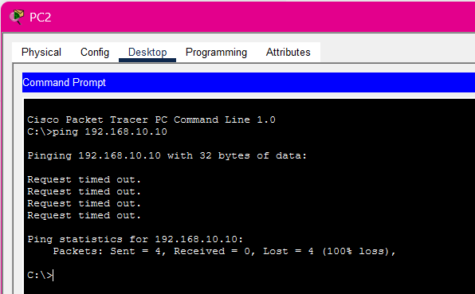
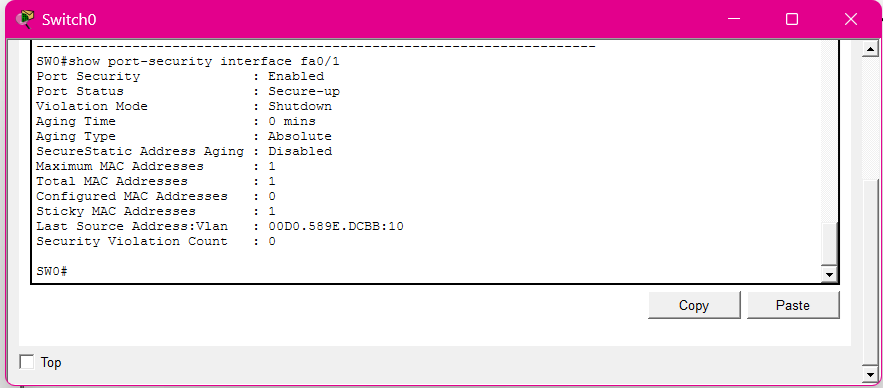

# 🌐 Secure Enterprise Network Lab

**Built as part of my CCNA: Introduction to Networks self-study journey, this project implements a complete secure enterprise 
network with 5 VLANs, inter-VLAN routing, DHCP services, port security, and access control lists.**

 

---

## 📋 Table of Contents

- [Project Overview](#-project-overview)
- [Network Architecture](#-network-architecture)
  - [Physical Topology](#physical-topology)
  - [Logical Topology](#logical-topology)
  - [VLAN Design](#vlan-design)
  - [IP Addressing Scheme](#ip-addressing-scheme)
- [Technologies Implemented](#-technologies-implemented)
- [Configuration Summary](#-configuration-summary)
  - [Router Configuration](#router-configuration)
  - [Switch Configuration](#switch-configuration)
- [Security Features](#-security-features)
  - [Port Security](#port-security)
  - [Access Control Lists (ACLs)](#access-control-lists-acls)
  - [SSH & Secure Management](#ssh--secure-management)
- [Verification & Testing](#-verification--testing)
  - [DHCP Verification](#dhcp-verification)
  - [ACL Testing Results](#acl-testing-results)
  - [Port Security Verification](#port-security-verification)
  - [SSH Access Verification](#ssh-access-verification)
- [Screenshots](#-screenshots)
- [Acknowledgments](#-acknowledgments)
- [License](#-license)
  
---

## 📖 Project Overview

This project implements a **complete enterprise network** as part of my **CCNA: Introduction to Networks** self-study journey. It 
simulates a real-world corporate environment where different departments require separate VLANs, controlled access between them, and secure management.

### What this project does

- 🔥 A fully simulated enterprise network where **ACLs decide who can talk to whom**
- 🏠 5 VLANs representing real departments (HR, Finance, IT, Management, Monitoring)
- 🔒 Unauthorized traffic is blocked at the network layer
- 🛡️ Port security prevents unauthorized devices from connecting
- 🔐 SSHv2 enables secure remote management
- 📡 DHCP automatically assigns IP addresses to all devices
- 🎓 Built as part of my **CCNA: Introduction to Networks self-learning journey**

### Why this project matters

In real enterprise networks:

- Finance should NOT access HR data ❌
- Monitoring systems must be restricted ❌
- HR should be able to communicate with Finance ✅
- IT needs access to all departments for support ✅
- Only authorized departments communicate securely ✅

**So instead of only learning theory, I built a working Cisco-style enterprise network simulation to understand:**

- How VLANs segment network traffic
- How ACLs enforce security policies
- How DHCP automates IP management
- How port security protects the network edge
- How SSH provides secure remote access

---

### Network Components

| Device | Model | Purpose |
|--------|-------|---------|
| Router0 | Cisco 1941 | Inter-VLAN routing, DHCP server, ACLs, SSH |
| Switch0 | Cisco 2960-24TT | VLANs 10 (HR), 20 (Finance), 30 (IT) |
| Switch1 | Cisco 2960-24TT | VLANs 40 (Management), 50 (Monitoring) |
| PCs (8) | PC-PT | End-user devices across all VLANs |

---

### Security Policies Implemented

| Source | Destination | Action | ACL |
|--------|-------------|--------|-----|
| Finance (VLAN 20) | HR (VLAN 10) | ❌ Blocked | ACL 100 |
| Finance (VLAN 20) | IT (VLAN 30) | ✅ Allowed | ACL 100 (implicit) |
| HR (VLAN 10) | Finance (VLAN 20) | ✅ Allowed | ACL 100 (implicit) |
| Monitoring (VLAN 50) | All VLANs | ❌ Blocked | ACL 101 |

---

## 📂 Network Architecture

### Physical Topology

The network is physically organized in a **Main Wiring Closet** with all devices rack-mounted:

```
┌─────────────────────────────────────────────────────────────────────┐
│                        MAIN WIRING CLOSET                           │
│                                                                     │
│  ┌─────────────────────────────────────────────────────────────┐    │
│  │              Power Distribution Device0                     │    │
│  └─────────────────────────────────────────────────────────────┘    │
│                              │                                      │
│  ┌─────────────────────────────────────────────────────────────┐    │
│  │                   Router0 (Cisco 1941)                      │    │
│  │              Inter-VLAN Routing & DHCP Server               │    │
│  │                                                             │    │
│  │         Gig0/0 ────────────────── Gig0/1                    │    │
│  └─────────────────────────────────────────────────────────────┘    │
│              │                                    │                 │
│              ▼                                    ▼                 │
│  ┌─────────────────────────┐    ┌─────────────────────────────┐     │
│  │   Switch0 (2960-24TT)   │    │   Switch1 (2960-24TT)       │     │
│  │                         │    │                             │     │
│  │  ┌───────────────────┐ │    │  ┌───────────────────────┐   │     │
│  │  │ VLAN 10: HR       │ │    │  │ VLAN 40: Management   │   │     │
│  │  │ Fa0/1 ── PC0      │ │    │  │ Fa0/1 ── PC6          │   │     │
│  │  │ Fa0/2 ── PC1      │ │    │  └───────────────────────┘   │     │
│  │  └───────────────────┘ │    │                              │     │
│  │  ┌───────────────────┐ │    │  ┌───────────────────────┐   │     │
│  │  │ VLAN 20: Finance  │ │    │  │ VLAN 50: Monitoring   │   │     │
│  │  │ Fa0/3 ── PC2      │ │    │  │ Fa0/2 ── PC7          │   │     │
│  │  │ Fa0/4 ── PC3      │ │    │  └───────────────────────┘   │     │
│  │  └───────────────────┘ │    │                              │     │
│  │  ┌───────────────────┐ │    │  ┌───────────────────────┐   │     │
│  │  │ VLAN 30: IT       │ │    │  │                       │   │     │
│  │  │ Fa0/5 ── PC4      │ │    │  │                       │   │     │
│  │  │ Fa0/6 ── PC5      │ │    │  │                       │   │     │
│  │  └───────────────────┘ │    │  │                       │   │     │
│  │                        │    │  │                       │   │     │
│  │    Gig0/1 (Trunk) ─────┼────┼── Gig0/1 (Trunk)         │   │     │
│  └────────────────────────┘    └─────────────────────────────┘      │
│                                                                     │
└─────────────────────────────────────────────────────────────────────┘
```


---

### Logical Topology

```
                    ┌─────────────────────────────────┐
                    │            Router0              │
                    │          (Cisco 1941)           │
                    │                                 │
                    │   • Inter-VLAN Routing          │
                    │   • DHCP Server                 │
                    │   • ACLs Applied                │
                    │   • SSH Server                  │
                    └───────────────┬─────────────────┘
                                    │
                    ┌───────────────┴───────────────┐
                    │                               │
                    │ (Trunk)                       │ (Trunk)
                    │ VLANs 10,20,30                │ VLANs 40,50
                    ▼                               ▼
        ┌───────────────────────┐   ┌───────────────────────┐
        │       Switch0         │   │       Switch1         │
        │    (2960-24TT)        │   │    (2960-24TT)        │
        │                       │   │                       │
        │  ┌─────────────────┐  │   │  ┌─────────────────┐  │
        │  │  VLAN 10: HR    │  │   │  │ VLAN 40: Mgmt   │  │
        │  │  PC0  PC1       │  │   │  │    PC6          │  │
        │  └─────────────────┘  │   │  └─────────────────┘  │
        │  ┌─────────────────┐  │   │  ┌─────────────────┐  │
        │  │ VLAN 20: Finance│  │   │  │ VLAN 50: Mon    │  │
        │  │  PC2  PC3       │  │   │  │    PC7          │  │
        │  └─────────────────┘  │   │  └─────────────────┘  │
        │  ┌─────────────────┐  │   │                       │
        │  │  VLAN 30: IT    │  │   │                       │
        │  │  PC4  PC5       │  │   │                       │
        │  └─────────────────┘  │   │                       │
        └───────────────────────┘   └───────────────────────┘
```

### VLAN Design

| VLAN ID | VLAN Name | Subnet | Gateway | Ports | Purpose |
|---------|-----------|--------|---------|-------|---------|
| 10 | HR | 192.168.10.0/24 | 192.168.10.1 | SW0 Fa0/1-2 | Human Resources Department |
| 20 | Finance | 192.168.20.0/24 | 192.168.20.1 | SW0 Fa0/3-4 | Finance Department |
| 30 | IT | 192.168.30.0/24 | 192.168.30.1 | SW0 Fa0/5-6 | IT Department |
| 40 | Management | 192.168.40.0/24 | 192.168.40.1 | SW1 Fa0/1 | Network Management |
| 50 | Monitoring | 192.168.50.0/24 | 192.168.50.1 | SW1 Fa0/2 | Network Monitoring |

### IP Addressing Scheme

| PC | VLAN | Assigned IP | Subnet Mask | Gateway | DHCP |
|----|------|-------------|-------------|---------|------|
| PC0 | HR (10) | 192.168.10.10 | 255.255.255.0 | 192.168.10.1 | ✅ Static |
| PC1 | HR (10) | 192.168.10.12 | 255.255.255.0 | 192.168.10.1 | ✅ DHCP |
| PC2 | Finance (20) | 192.168.20.11 | 255.255.255.0 | 192.168.20.1 | ✅ DHCP |
| PC3 | Finance (20) | 192.168.20.12 | 255.255.255.0 | 192.168.20.1 | ✅ DHCP |
| PC4 | IT (30) | 192.168.30.12 | 255.255.255.0 | 192.168.30.1 | ✅ DHCP |
| PC5 | IT (30) | 192.168.30.11 | 255.255.255.0 | 192.168.30.1 | ✅ DHCP |
| PC6 | Management (40) | 192.168.40.2 | 255.255.255.0 | 192.168.40.1 | ✅ DHCP |
| PC7 | Monitoring (50) | 192.168.50.10 | 255.255.255.0 | 192.168.50.1 | ✅ Static |

---

## 🚀 Technologies Implemented

### Layer 2 Technologies
- **VLANs**: 5 isolated broadcast domains for departmental segmentation
- **Trunking**: 802.1Q trunking between switches and router
- **Port Security**: Sticky MAC addresses with violation shutdown

### Layer 3 Technologies
- **Inter-VLAN Routing**: Router-on-a-stick with subinterfaces
- **DHCP**: Dynamic Host Configuration Protocol for automatic IP assignment
- **Connected Routes**: Directly connected routes for all VLANs

### Security Technologies
- **Port Security**: MAC address lockdown on access ports
- **Access Control Lists (ACLs)**: Extended ACLs for traffic filtering
- **SSHv2**: Secure Shell for encrypted remote management
- **Password Encryption**: Service password-encryption for all passwords
- **Login Banners**: Legal notification banners for unauthorized access

### Management Technologies
- **SSH**: Secure Shell for remote access
- **Console Security**: Password-protected console access
- **Logging**: Buffered and console logging for troubleshooting

---

## 📝 Configuration Summary

### Router Configuration (R1)

**Key configurations applied to Router0:**

#### 1. Hostname and Security

```cisco
hostname R1
enable secret SuperSecure@2024!
service password-encryption

banner motd ^C
*************************************************
*      UNAUTHORIZED ACCESS IS PROHIBITED       *
*      ALL ACTIVITIES ARE MONITORED            *
*      CONNECTIONS ARE LOGGED                  *
*      By connecting you agree to these terms  *
*************************************************
^C
```

#### 2. DHCP Configuration

```cisco
! Exclude gateway and reserved addresses
ip dhcp excluded-address 192.168.10.1 192.168.10.10
ip dhcp excluded-address 192.168.20.1 192.168.20.10
ip dhcp excluded-address 192.168.30.1 192.168.30.10
ip dhcp excluded-address 192.168.40.1 192.168.40.10
ip dhcp excluded-address 192.168.50.1 192.168.50.10

! DHCP Pools for each VLAN
ip dhcp pool HR_POOL
 network 192.168.10.0 255.255.255.0
 default-router 192.168.10.1
 dns-server 8.8.8.8

ip dhcp pool FINANCE_POOL
 network 192.168.20.0 255.255.255.0
 default-router 192.168.20.1
 dns-server 8.8.8.8

ip dhcp pool IT_POOL
 network 192.168.30.0 255.255.255.0
 default-router 192.168.30.1
 dns-server 8.8.8.8

ip dhcp pool MANAGEMENT_POOL
 network 192.168.40.0 255.255.255.0
 default-router 192.168.40.1
 dns-server 8.8.8.8

ip dhcp pool MONITORING_POOL
 network 192.168.50.0 255.255.255.0
 default-router 192.168.50.1
 dns-server 8.8.8.8
```

### 3. Inter-VLAN Routing (Subinterfaces)

```cisco
! Switch0 Connection
interface GigabitEthernet0/0
 no ip address
 duplex auto
 speed auto

interface GigabitEthernet0/0.10
 encapsulation dot1Q 10
 ip address 192.168.10.1 255.255.255.0

interface GigabitEthernet0/0.20
 encapsulation dot1Q 20
 ip address 192.168.20.1 255.255.255.0
 ip access-group 100 in    ! ACL applied here

interface GigabitEthernet0/0.30
 encapsulation dot1Q 30
 ip address 192.168.30.1 255.255.255.0

! Switch1 Connection
interface GigabitEthernet0/1
 no ip address
 duplex auto
 speed auto

interface GigabitEthernet0/1.40
 encapsulation dot1Q 40
 ip address 192.168.40.1 255.255.255.0

interface GigabitEthernet0/1.50
 encapsulation dot1Q 50
 ip address 192.168.50.1 255.255.255.0
 ip access-group 101 in    ! ACL applied here
```

### 4. Access Control Lists

```cisco
! ACL 100: Block Finance → HR
access-list 100 deny ip 192.168.20.0 0.0.0.255 192.168.10.0 0.0.0.255
access-list 100 permit ip any any

! ACL 101: Block Monitoring → All VLANs
access-list 101 deny ip 192.168.50.0 0.0.0.255 192.168.10.0 0.0.0.255
access-list 101 deny ip 192.168.50.0 0.0.0.255 192.168.20.0 0.0.0.255
access-list 101 deny ip 192.168.50.0 0.0.0.255 192.168.30.0 0.0.0.255
access-list 101 deny ip 192.168.50.0 0.0.0.255 192.168.40.0 0.0.0.255
access-list 101 permit ip any any
```

### 5. SSH Configuration

```cisco
ip domain-name securelab.local
crypto key generate rsa modulus 2048
ip ssh version 2
ip ssh authentication-retries 3
ip ssh time-out 60

username admin privilege 15 secret Secure@2024!
username network-admin privilege 15 secret Net@dm1n2024!

line vty 0 4
 transport input ssh
 login local
 exec-timeout 5 0
 logging synchronous
```

---

## Switch Configuration (SW0 & SW1)

Key configurations applied to both switches:

### 1. VLAN Creation (SW0)

```cisco
vlan 10
 name HR
vlan 20
 name Finance
vlan 30
 name IT
```
### 2. Access Port Configuration (SW0)

```cisco
! Example: Port Fa0/1 (HR)
interface fastEthernet 0/1
 switchport mode access
 switchport access vlan 10
 switchport port-security
 switchport port-security maximum 1
 switchport port-security violation shutdown
 switchport port-security mac-address sticky
 no shutdown

! Repeat for all access ports
```

### 3. Trunk Port Configuration

```cisco
! SW0 - Trunk to Router
interface gigabitEthernet 0/1
 switchport mode trunk
 switchport trunk allowed vlan 10,20,30
 no shutdown
```

```cisco
! SW1 - Trunk to Router
interface gigabitEthernet 0/1
 switchport mode trunk
 switchport trunk allowed vlan 40,50
 no shutdown
```

### 4. Switch Security

```cisco
service password-encryption
enable secret SuperSecure@2024!
username admin privilege 15 secret Secure@2024!

line console 0
 password C0nS0l3@2024!
 login
 logging synchronous
 exec-timeout 5 0

line vty 0 4
 transport input ssh
 login local
 exec-timeout 5 0
 logging synchronous
```

---

## 🔒 Security Features

### Port Security

All access ports are secured with port security:

| Feature | Configuration | Purpose |
|---------|---------------|---------|
| Maximum MAC Addresses | `switchport port-security maximum 1` | Only one device per port |
| Violation Mode | `switchport port-security violation shutdown` | Port disabled on violation |
| Sticky MAC | `switchport port-security mac-address sticky` | Automatically learns and locks MAC |

**Verification Output:**

```cisco
SW0#show port-security
Secure Port  MaxSecureAddr  CurrentAddr  SecurityViolation  Security Action
Fa0/1        1              1            0                  Shutdown
Fa0/2        1              1            0                  Shutdown
Fa0/3        1              1            0                  Shutdown
Fa0/4        1              1            0                  Shutdown
Fa0/5        1              1            0                  Shutdown
Fa0/6        1              1            0                  Shutdown
```

### Access Control Lists (ACLs)

| ACL | Source | Destination | Action | Applied To |
|-----|--------|-------------|--------|------------|
| 100 | Finance (20) | HR (10) | Deny | Gig0/0.20 (in) |
| 100 | Any | Any | Permit | Gig0/0.20 (in) |
| 101 | Monitoring (50) | All VLANs | Deny | Gig0/1.50 (in) |
| 101 | Any | Any | Permit | Gig0/1.50 (in) |

**ACL Match Counters (Proof of Working):**

```cisco
R1#show access-lists
Extended IP access list 100
    10 deny ip 192.168.20.0 0.0.0.255 192.168.10.0 0.0.0.255 (52 matches)
    20 permit ip any any (46 matches)

Extended IP access list 101
    10 deny ip 192.168.50.0 0.0.0.255 192.168.10.0 0.0.0.255 (4 matches)
    20 deny ip 192.168.50.0 0.0.0.255 192.168.20.0 0.0.0.255
    30 deny ip 192.168.50.0 0.0.0.255 192.168.30.0 0.0.0.255
    40 deny ip 192.168.50.0 0.0.0.255 192.168.40.0 0.0.0.255
    50 permit ip any any (10 matches)
```

### SSH & Secure Management

| Feature | Status |
|---------|--------|
| SSH Version | 2.0 |
| Authentication | Local username/password |
| Password Encryption | Enabled |
| Login Banners | Enabled |
| Console Security | Password protected |
| VTY Lines | SSH only (no Telnet) |

**SSH Configuration Verified:**

```cisco
R1#show ip ssh
SSH Enabled - version 2.0
Authentication timeout: 60 secs
Authentication retries: 3
```

---

## ✅ Verification & Testing

### DHCP Verification

**DHCP Bindings:**

```cisco
R1#show ip dhcp binding
IP address       Client-ID/        Lease expiration    Type
                 Hardware address
192.168.10.11    00D0.589E.DCBB    --                  Automatic
192.168.10.12    00E0.F704.443D    --                  Automatic
192.168.20.11    0001.4236.A526    --                  Automatic
192.168.20.12    0030.A377.682E    --                  Automatic
192.168.30.11    0001.63AC.050C    --                  Automatic
192.168.30.12    0001.C7C2.E4AB    --                  Automatic
192.168.40.2     0050.0FA9.4D27    --                  Automatic
192.168.50.2     0060.2F9E.DA62    --                  Automatic
```
---

**DHCP Pools Summary:**

```
Pool HR_POOL:
   Total addresses: 254
   Leased addresses: 2
   Excluded addresses: 8

Pool FINANCE_POOL:
   Total addresses: 254
   Leased addresses: 2
   Excluded addresses: 8

Pool IT_POOL:
   Total addresses: 254
   Leased addresses: 2
   Excluded addresses: 8

Pool MANAGEMENT_POOL:
   Total addresses: 254
   Leased addresses: 1
   Excluded addresses: 8

Pool MONITORING_POOL:
   Total addresses: 254
   Leased addresses: 1
   Excluded addresses: 8
```

---

### ACL Testing Results

| Test | Source | Destination | Expected | Actual Result | Status |
|------|--------|-------------|----------|---------------|--------|
| 1 | PC2 (Finance) | PC0 (HR) | ❌ Blocked | Destination host unreachable | ✅ Pass |
| 2 | PC0 (HR) | PC2 (Finance) | ✅ Allowed | Successful replies | ✅ Pass |
| 3 | PC2 (Finance) | PC4 (IT) | ✅ Allowed | Successful replies | ✅ Pass |
| 4 | PC7 (Monitoring) | PC0 (HR) | ❌ Blocked | Destination host unreachable | ✅ Pass |

---

**Test 1: Finance → HR (Blocked)**

```
C:\>ping 192.168.10.10
Reply from 192.168.20.1: Destination host unreachable.
```

**Test 2: HR → Finance (Allowed)**

```
C:\>ping 192.168.20.11
Reply from 192.168.20.11: bytes=32 time<1ms TTL=127
```

**Test 3: Finance → IT (Allowed)**

```
C:\>ping 192.168.30.12
Reply from 192.168.30.12: bytes=32 time<1ms TTL=127
```

**Test 4: Monitoring → HR (Blocked)**

```
C:\>ping 192.168.10.10
Reply from 192.168.50.1: Destination host unreachable.
```
---

### Port Security Verification

**Port Security Detail (Fa0/1):**

```cisco
SW0#show port-security interface fa0/1
Port Security              : Enabled
Port Status                : Secure-up
Violation Mode             : Shutdown
Aging Time                 : 0 mins
Aging Type                 : Absolute
SecureStatic Address Aging : Disabled
Maximum MAC Addresses      : 1
Total MAC Addresses        : 1
Configured MAC Addresses   : 0
Sticky MAC Addresses       : 1
Security Violation Count   : 0
```
---

### SSH Access Verification

**SSH Connection Established:**

```
PC0> ssh -l admin 192.168.10.1
Password: ************

*************************************************
*      UNAUTHORIZED ACCESS IS PROHIBITED       *
*      ALL ACTIVITIES ARE MONITORED            *
*      CONNECTIONS ARE LOGGED                  *
*      By connecting you agree to these terms  *
*************************************************

R1>
```
---

## 📸 Screenshots

### Network Topology


*Logical network topology showing all devices and connections*

---


*Physical rack view in Main Wiring Closet*

---
---

### VLAN & Trunk Configuration


*VLAN configuration on Switch0 (VLANs 10, 20, 30)*

---


*VLAN configuration on Switch1 (VLANs 40, 50)*

---


*Trunk ports on Switch0 (VLANs 10, 20, 30)*

---


*Trunk ports on Switch1 (VLANs 40, 50)*

---
---

### DHCP Configuration


*DHCP IP assignments for all PCs*

---


*DHCP pool configuration for all VLANs*

---
---

### Router Configuration


*Router interface status and IP addresses*

---


*Routing table showing connected routes*

---


*Router configuration - Hostname, passwords, DHCP exclusions*

---


*Router configuration - DHCP pools and timezone*

---


*Router configuration - Subinterfaces and ACLs*

---


*Router configuration - SSH, banners, and VTY lines*

---
---

### Access Control Lists (ACLs)


*ACL match counters proving traffic filtering*

---



*Finance (PC2) → HR (PC0) blocked by ACL 100*

---


*HR (PC0) → Finance (PC2) allowed*

---


*Finance (PC2) → IT (PC4) allowed*

---


*Monitoring (PC7) → HR (PC0) blocked by ACL 101*

---
---

### Port Security


*Port security summary on Switch0*

---



*Port security detail for Fa0/1 (sticky MAC)*

---


*Security violation proof on Switch0*

---
---

### SSH & Secure Management


*SSH server configuration on Router0*

---


*SSH connection from PC0 to Router0*

---


*Unauthorized access prohibited banner*

---
---

### Verification


*Successful ping between HR and Finance*

---


*Switch configuration (VLANs and port security)*

---
---

## 📝 Acknowledgments

This project was completed as part of my **CCNA: Introduction to Networks** self-study journey. It demonstrates practical application of:

- VLANs and trunking
- Inter-VLAN routing
- DHCP services
- Port security
- Access Control Lists
- SSH configuration
- Network troubleshooting
- Professional documentation

---

## 📧 License

This project is licensed under the **MIT License** - see the [LICENSE](LICENSE) file for details.

---

## 📝 Author

**Dijenthini M.X**

[](https://github.com/dijenthini)
[](https://www.linkedin.com/in/dijenthini-mariya-xavier-a70a21368)

---

This project represents a significant milestone in my networking journey. By implementing and documenting this enterprise network, I've gained hands-on experience with:

- ✅ Cisco IOS CLI
- ✅ Network design principles
- ✅ Security best practices
- ✅ Technical documentation
- ✅ Troubleshooting methodology

---

> *"Networking is not just about connecting devices; it's about connecting people, ideas, and opportunities."*

---

**Thank you for viewing my Secure Enterprise Network Lab project!**

---

<div align="center">
  <sub>Built with ❤️ for learning and growth</sub>
</div>
